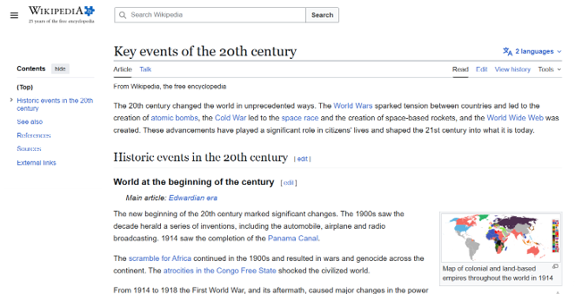
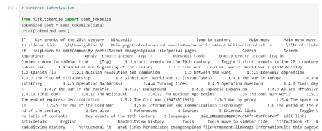
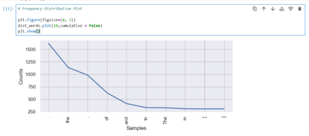
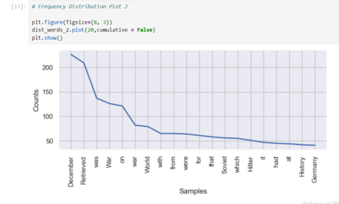
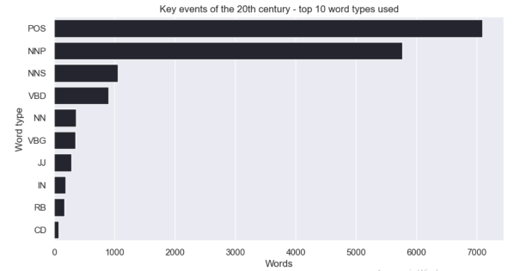
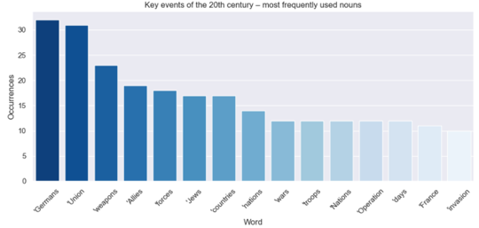
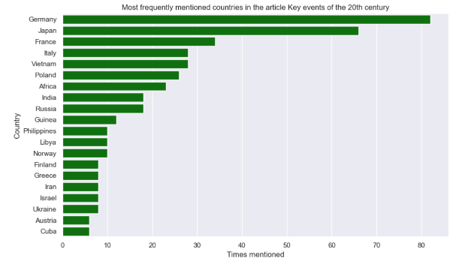
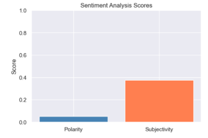
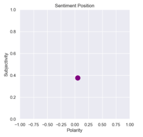

# Historical Network Mapping of 20th‑Century Global Relations

## Project Goal
To perform network analysis by text mining, web scraping, and Natural Language Processing (NLP) on historical records to map, analyze, and visualize the complex geopolitical relationships and alliances between global powers throughout the 20th century.

## Objectives
- Identify and extract country mentions and interactions from historical textual data using a customized NLP pipeline.
- Compute network graph centrality metrics (degree, closeness, betweenness) to pinpoint the most influential global superpowers during the 20th century.
- Build a dynamic, interactive network visualization that clearly distinguishes distinct geopolitical communities and country alliances.

## Data:
A publicly available dataset scraped from the [Key events of the 20th century](https://en.wikipedia.org/wiki/Key_events_of_the_20th_century) Wikipedia page, containing unstructured historical records of global political events, milestones, and international relations used for text mining and network mapping. 

## Scope
- Analyze unstructured textual data scraped from the public Wikipedia page for the 20th century to extract historical milestones, country interactions, and international relationships.
- Identify and document the explicit connections and alliances between global powers by executing text mining and a NLP algorithm on the collected text.
- Determine the exact mathematical influence of each nation within the historical network by calculating their degree, closeness, and betweenness centrality metrics.
- Develop a dynamic, interactive network visualization chart that clearly distinguishes distinct geopolitical communities, relationships, and country clusters.
- Provide a polished, public-facing analytical overview that delivers a clear narrative of 20th-century geopolitical ties to inform the research of the Institute for Public Policy.  

## Tools:
- Python (BeautifulSoup/Scrapy, NLTK/SpaCy, NetworkX, PyVis)
- Anaconda
- Git/GitHub and version control
- Web scraping, text mining, and tokenization
- Entity recognition pipelines (via NLTK or SpaCy) to extract cross-country mentions and construct structural dataframes from unstructured text

## Skills:
- Web scraping, text mining, and ethical data harvesting: extracting unstructured textual data from online sources while adhering to website terms of use.
- Natural Language Processing (NLP) and data wrangling: implementing tokenization and entity recognition algorithms to transform raw text into structured relational datasets.
- Network graph theory and centrality analysis: computing mathematical metrics (degree, closeness, and betweenness) to measure node influence and isolate structural hubs.
- Dynamic and interactive data visualization: designing community-grouped network charts to visually communicate complex relationships and clusters.
- Analytical storytelling and stakeholder reporting: translating algorithmic outputs into a clear narrative and presentation for public-facing or institutional research.

# Methodological Approach
## Data Preparation
- Scraped unstructured historical text and lists of countries directly from Wikipedia while checking legal terms of use and ethical scraping boundaries.
- Configured a isolated Anaconda virtual environment to safely manage Python libraries and dependencies.
- Wrangled and structured raw textual inputs to format them cleanly for text mining and algorithmic analysis.

## Analysis
- Applied NLP algorithms to tokenized historical texts to detect cross-country mentions and build a valid relational dataframe.
- Executed text mining techniques and constructed frequency bar plots to map out fundamental data patterns.
- Calculated network metrics including degree, closeness, and betweenness centrality to evaluate individual country influence within the global graph.

## Results 
- Compiled a comprehensive relational matrix documenting precisely how global powers connected during major 20th-century milestones.
- Generated dynamic network charts that mathematically group countries into distinct color-coded communities based on historical ties.
- Delivered a refined interactive visualization suite tailored for the Institute for Public Policy to communicate findings openly to the public.
  
---

## Accessing Web Data content of Key events of 20th century page with Data Scraping

- Explain the legal and ethical intricacies of data scraping by checking the terms of use.
- Organize anenvironment to perform a data scrape by implementing Python libraries into
a virtual environment.
- Executeadatascrape on a website to collect web data.

## Text Mining

- Tokenized the words from the text and created a bar chart to plot the 10 most common words

- Frequency Distribution Plot

  

- New plot with removed stop-words and punctuations.

   

 - List of the Top 10 part of speech (POS) tags for words that appear in the article

  

- Bar plots with the top 15 POS labels for nouns

 

- Create a count for the countries name 

  

Sentiment analysis revealed that the text has a slightly positive, but essentially neutral tone (polarity = 0.05) and is fairly objective (subjectivity = 0.38). In other words, the writing is mostly factual with only a mild emotional coloring.

  

 
## Network Analysis

...

## Network Visualizations

...

## Key Findings:

- The most central nations in the network graph perfectly match historical superpowers, explicitly confirmed by dominant degree and closeness centrality scores during major global conflicts.
- Geopolitical clustering within the dynamic network visualization automatically mapped out real-world alliances (such as the Allied/Axis powers or Cold War blocs) without manual grouping.

## Recommendations:

- Use the structural network hubs identified in this study to predict modern diplomatic friction points, as past historical ties continue to dictate modern foreign policy resistance.
- Incorporate chronological sub-graphs (e.g., pre-WWII vs. Cold War eras) in future research to track how quickly a country's network position can shift from a core superpower to an isolated node.
  
---

## Project Challenges 

- Handling Semantic Noise: Filtering out passing geographic mentions in text that did not actually imply a true political or historical relationship between nations.
- Network Visualization Overcrowding: Managing a massive, messy network graph where overlapping country nodes and labels made visual interpretation impossible initially.

## Solutions:

- Optimized the NLP pipeline with stricter co-occurrence windows, ensuring country connections were only logged if they appeared within a shared, contextually relevant sentence block.
- Applied iterative styling adjustments to the graph, using modular layout algorithms to repel text labels and sizing nodes dynamically relative to their centrality scores.

---

## Future Steps:

It will be interesting to expand to the 21st Century - scale the web-scraping pipeline to track post-2000 digital diplomatic archives, mapping how modern conflicts and trading blocs have reshaped the historical 20th-century baseline.

---

## Project Files

For more details, see the [20th-century](https://github.com/Daria-Navrotska/20th-century) Project on GitHub.
