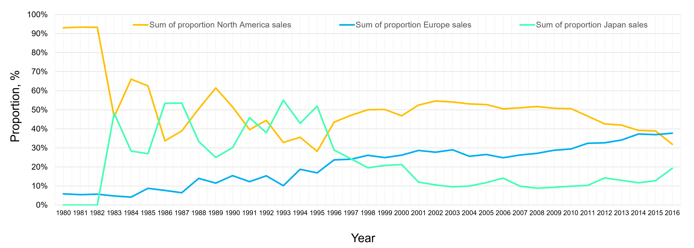
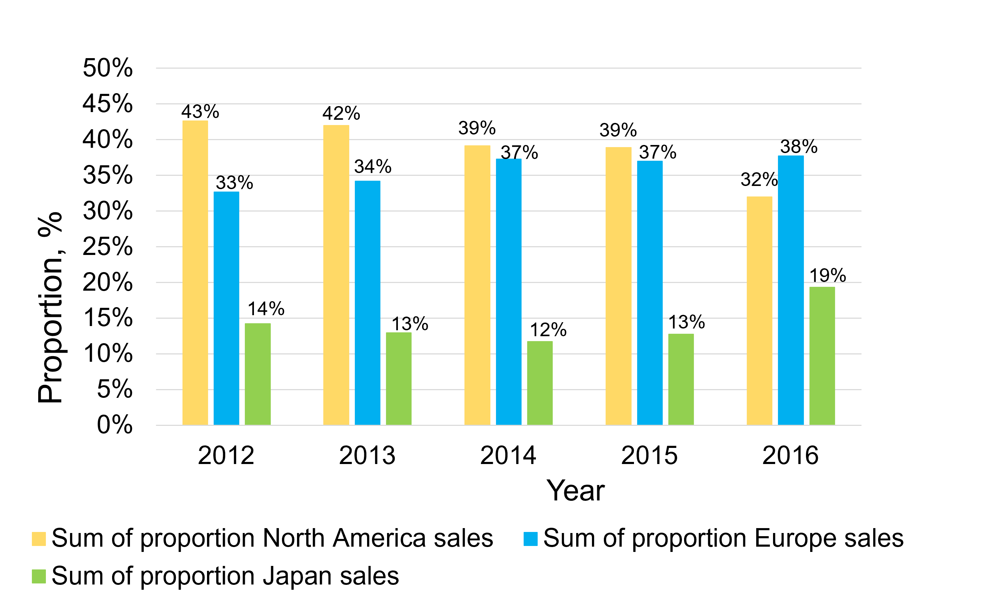
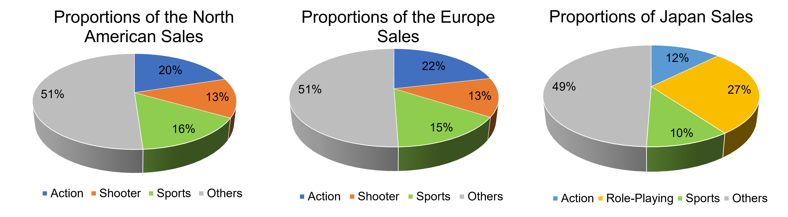

# Global Video Game Sales Analysis for Market Strategy

## Project Goal
To perform a comprehensive descriptive analysis of historical video game sales data to help a new gaming studio, GameCo, understand market trends, evaluate competitor performance, and make data-driven decisions for new game development and budget allocation.

## Objectives
- Identify popular game genres and platforms. 
- Analyze competitor publishers by market share.
- Track changes in game popularity over time.
- Examine regional sales trends across North America, Europe, and Japan.

## Data:
Video Game Popularity Data [VGChartz] (https://www.vgchartz.com/): historical dataset tracking the total number of units sold (in millions) from 1980 to 2016 for global video games selling more than 10,000 copies. Features include unit sales metrics segmented across different gaming platforms, genres, geographic regions, and publishing studios, used to analyze market trends and competitor performance. 

## Scope
- Demonstrate my ability to translate business questions into analytical workflows.
- Clean and structure complex datasets.
- Extract insights using statistical and visual techniques.
- Communicate findings effectively to stakeholders.

## Tools:
- Excel and csv files.
- Data cleaning: removed inconsistencies, standardized formats. 
- Descriptive analytics: grouping, summarizing, and hypothesis testing. 
- Visualizations, hypothesis testing, and storytelling.

## Skills:
- Data cleaning, formatting, and handling of "dirty" video game datasets in Excel.
- Data aggregation, subsegment filtering, and variable derivation using Pivot Tables.
- Statistical distribution profiling and calculation of descriptive summary statistics.
- Advanced data visualization (bar/column charts, scatter plots, and box-and-whisker plots).
- Analytical storytelling and delivering executive insights to business stakeholders.

# Methodological Approach
## Data Preparation
- Defined the dimensions, data categories, characteristics, and potential biases inherent in the historical dataset.
- Cleaned a "dirty" version of the video game sales dataset to address anomalies, correct formatting issues, and standardize data points in Excel.

## Analysis
- Calculated descriptive statistics and evaluated data distributions to profile variables across gaming platforms, genres, and publishing studios.
- Aggregated and subsegmented the data using Excel Pivot Tables to isolate key target markets (such as North America) and derived new variables to capture market swings over time.
- Conducted comparative analysis across geographic regions, tracking unit sales fluctuations from 1980 to 2016 to validate strategic business hypotheses.

## Results 
- Summarized analytical findings through structured exercises to pinpoint optimal marketing budget allocations and competitive market threats.
- Developed clearly labeled charts—including bar/column charts, scatter plots, and box-and-whisker plots—to map out category trends and relationships between variables.
- Delivered a clear narrative and presentation of insights tailored specifically for GameCo’s executives to drive new game development strategies.  

---

## Sales distribution during 1980-2016

The data from 2016 demonstrates that the best video game sales are happening in Europe. This is an interesting insight, which requires further investigation into the reasons behind it. For example, understanding why sales decreased in North America will help us analyze the situation and find solutions as well as new strategies to stimulate sales increase there. Also, it would be worthwhile finding out what sold best in the European market, in which regions and in which genres. Based on this information, GameCo could consider investment in and promotion marketing in these areas to maintain high sales there. Moreover, the European example and successful strategy could be used as a sample (prototype) for other markets or populations. I think these outcomes will be interesting for the Chief Financial Officer and Senior Vice President of Sales of the GameCo company.

## Proportions of sales for the last five years

- Europe became the top video game market after 2016.
- This challenges GameCo’s assumption of stable regional trends.

## Genre breakdown of top-selling video games around the world – who plays what?

- Top-selling genres in North America and Europe: Action, Sports, and Shooter games.
- Japan’s leading genres: Role-Playing, Action, and Sports games.
- Genre-based sales data helps identify high-revenue categories across regions.
- Insight supports strategic budget allocation for GameCo’s marketing team.
- Focusing on best-selling genres can improve ROI and audience targeting.

## Key Findings:

- Regional Dominance Has Shifted Over Time: Europe has become the top-performing market for video game sales since 2016, overtaking North America and Japan. This challenges GameCo's prior assumption of consistent regional leadership and underscores the need to monitor evolving market dynamics more closely. 

- Genre Preferences Vary Significantly by Region: While North America and Europe share strong performance in Action, Sport, and Shooter genres, Japan remains uniquely aligned with Role-Playing titles. This confirms the influence of regional cultural trends and emphasizes the importance of tailoring genre strategies per market. 

## Recommendations:

- Conduct a regional genre analysis in Europe to identify high-revenue categories and guide resource allocation.
- Launch targeted marketing campaigns in top-performing European markets to boost brand visibility and engagement.
- Use Europe’s success model as a blueprint for global expansion into similar markets.
- Align genre strategy with ROI goals to enhance audience targeting and monetization.

---

## Project Challenges 

- Analyzing historical data tracking over three decades of sales across varying platforms and genres meant handling raw, "dirty" data anomalies.
- Aggregating high-volume unit sales data spanning millions of copies into clear, distinct subsegments without losing track of nuanced regional shifts.

## Solutions:

- Reallocated Strategic Focus to European Markets: Pivot target expansion plans to prioritize Europe as the primary market volume driver, responding directly to its post-2016 emergence over North America and Japan.
- Implemented Dynamic Market Monitoring: Established an ongoing framework to track and respond to shifting regional sales dynamics instead of relying on stagnant, historical market leadership assumptions.
- Developed Cross-Regional Genre Profiles: Aligned game development pipelines for North America and Europe to focus heavily on high-performing Action, Sports, and Shooter titles.
- Localized Genre Strategies for Specialized Markets: Tailored market-specific content strategies, specifically isolating Japan for specialized Role-Playing Game (RPG) development to match cultural consumer preferences.

---

## Future Steps:

- Expand Market Longevity Models: Integrate modern digital distribution and live-service monetization data beyond physical unit sales to track current post-2016 market dynamics.
- Predictive Performance Benchmarking: Develop predictive models using historical platform and genre trajectories to estimate the launch-week unit sales of GameCo's upcoming titles.

---

## Project Files

For more details, see the project details on ([GitHub](https://github.com/Daria-Navrotska))
