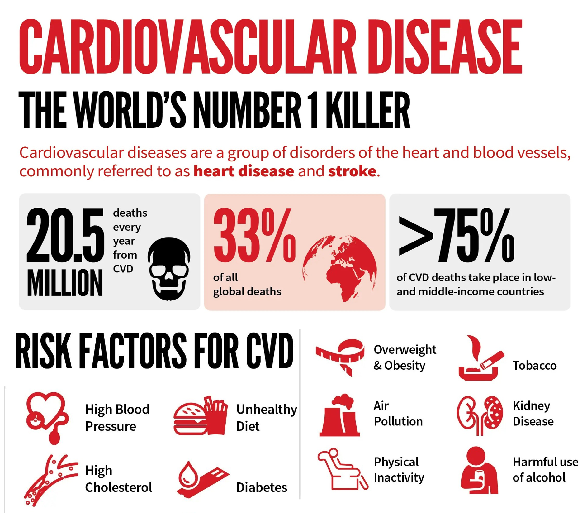
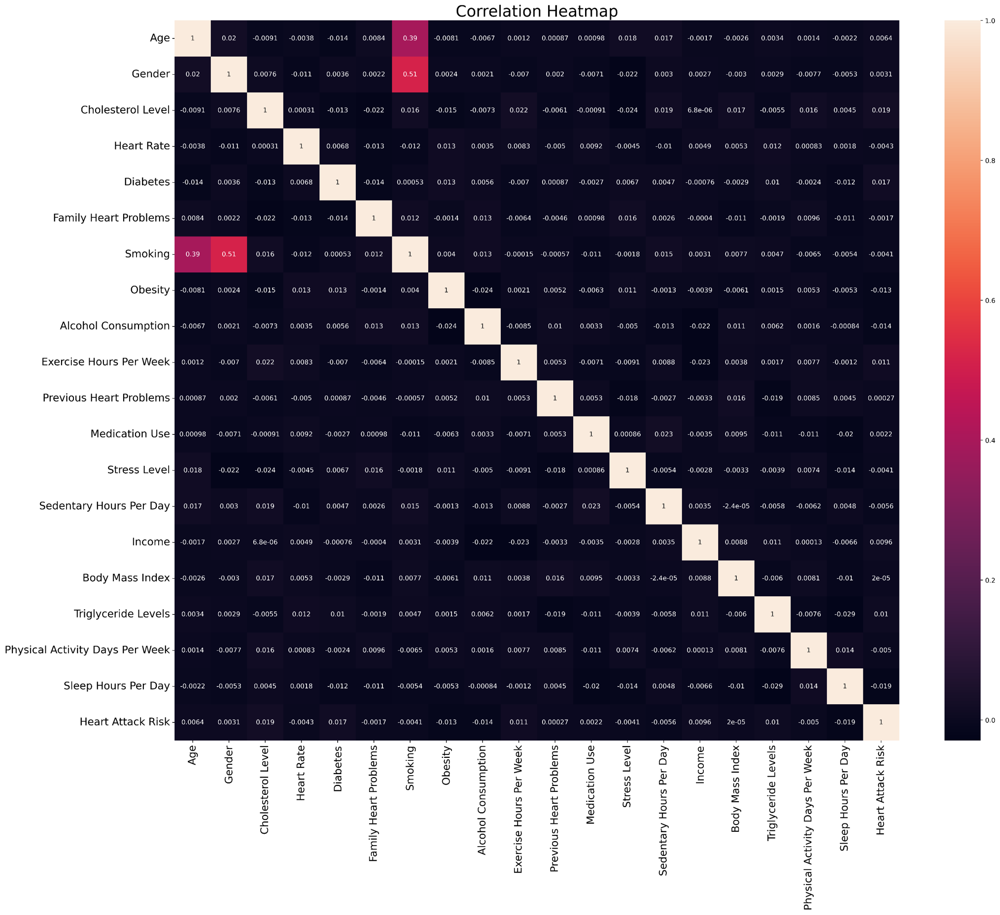
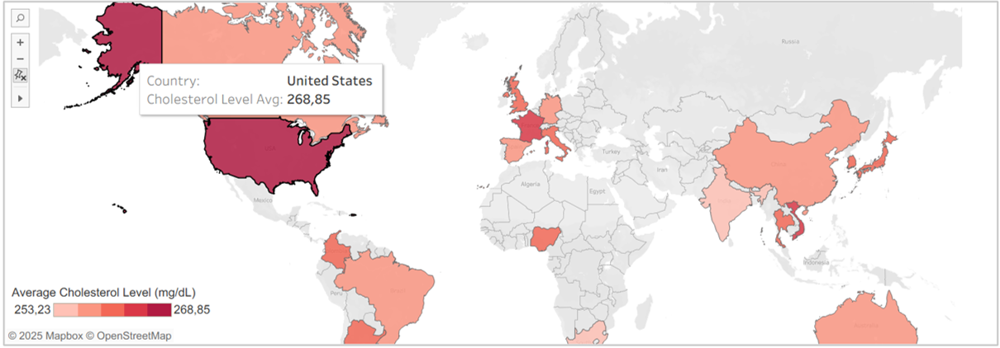
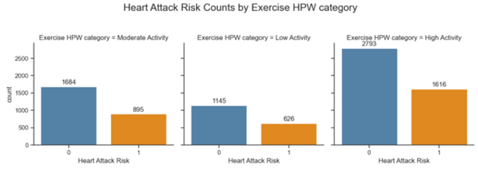
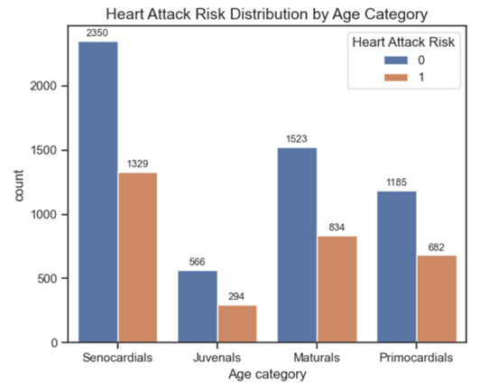
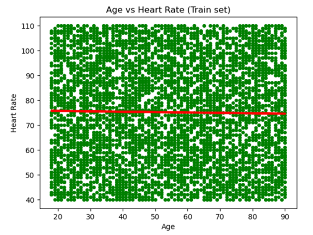
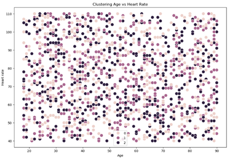
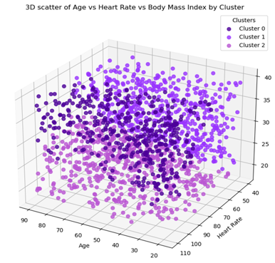
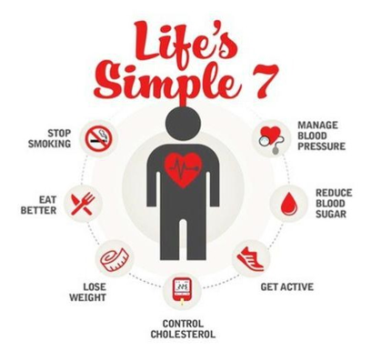

# Uncovering Hidden Patterns in Heart Attack Risk

  

## Project Goal
To develop a predictive analytics workflow that identifies key factors influencing heart attack risk using machine learning techniques applied to synthetic medical and global health data.

## Objectives
- Analyze heart attack risk factors across global populations using synthetic health data.
- Identify key predictors and patterns to support preventive strategies and public health awareness.

## Data:
- Heart Attack Risk Prediction (Kaggle): synthetic dataset with 8,763 global patient records including clinical, behavioral, and geographic features such as age, cholesterol, blood pressure, BMI, smoking, exercise, diet, and heart attack risk indicators.
- Cardiovascular Disease Death Rate (WHO via Our World in Data): time-series data reporting global death rates from cardiovascular diseases (1950–2023), segmented by age and gender, per 100,000 people. Used for historical trend analysis.

## Scope
- Explore synthetic patient health records and global cardiovascular trends.
- Build and evaluate machine learning models for risk prediction.
- Identify the most influential clinical and lifestyle factors contributing to heart attack likelihood.
- Visualize health indicators and model outputs for clear interpretation.
- Translate analytical findings into actionable insights for public health and prevention strategies.

## Tools:
- Python (with pandas, NumPy, matplotlib, seaborn, scipy, scikit-learn)
- Jupyter Notebooks
- Folium & JSON: For interactive geographic mapping and handling structured data formats.
- Exploratory Data Analysis (EDA): Uncovered trends, correlations, and health risk patterns
- Regression & Clustering Models: Applied to assess relationships and group individuals based on health profiles. 
- Visualization in Python
- Time-Series Analysis: Used to explore historical cardiovascular mortality trends from WHO data.

## Skills:
- Strengthened technical skills in Python coding and health data visualization.
- Deepened understanding of core machine learning principles through regression and clustering techniques.
- Gained hands‑on experience with synthetic medical data and global health trend analysis.
- Learned to translate complex health datasets into actionable insights for public health strategies.

    

# Methodological Approach
## Data Preparation
- Imported and cleaned synthetic patient datasets and global health indicators.
- Handled missing values, standardized formats, and encoded categorical variables.
- Performed feature engineering to create clinically meaningful predictors.
- Normalized and scaled numerical variables for model stability.
- Split data into training, validation, and testing subsets.

## Analysis
- Conducted exploratory data analysis to identify correlations and risk‑related patterns.
- Applied logistic regression, decision trees, and clustering to model heart attack risk.
- Evaluated model performance using accuracy, precision, recall, and ROC‑AUC.
- Assessed feature importance to determine the strongest predictors.
- Compared model behaviors to understand trade‑offs between interpretability and performance.

## Results 
- Identified key risk factors such as cholesterol levels, blood pressure, age, and lifestyle indicators.
- Achieved strong predictive performance with models capable of distinguishing high‑risk individuals.
- Revealed meaningful patient clusters representing distinct cardiovascular risk profiles.
- Produced visualizations that clearly communicate risk patterns and model insights.
- Generated actionable recommendations for early intervention and targeted prevention strategies.

---

## Cardiovascular diseases and Heart Attack Risk

**Cardiovascular diseases (CVDs)** are the leading cause of death globally, taking an estimated **17.9 million lives each year** according to the World Health Organisation. More than four out of five CVD deaths are due to heart attacks and strokes, and one third of these deaths occur prematurely in people under 70 years of age.
Goal is to identify patterns of heart attack risk across a population. Rather than focusing solely on individual predictions, analysed dataset allows to focus on broader trends such as which age groups, lifestyle profiles, or clinical markers are most associated with elevated heart rate and attack risk. 

## How Health Metrics Relate to Heart Attack Risk

At the beginning the linear relationship between different variables were investigated. There are a very **weak negative relationship** between Heart Rate, Family Hear Problems, Smoking, Obesity, Alcohol Consumption, Stress Level, Sedentary Hours Per Day, Physical Activity Days Per Week, Sleep Hours Per Day and Heart Attack Risk indicating **no meaningful linear relationship between mentioned parameters and heart attack risk based on explored data** (despite the common medical knowledge linking some of them to cardiovascular issues).

## What Cholesterol Levels Reveal About Global Heart Attack Risk?

- Cholesterol is a key heart risk factor, making its global distribution a revealing health indicator.
- USA, France, and Vietnam rank among the global leaders in average cholesterol levels.
- However, Cholesterol Level alone do not reliably predict Heart Attack Risk, according to correlation data. 

## Does Age and Exercise Frequency Matter for Heart Attack Risk?

Exercise Hours Per Week (HPW) shows inconsistent impact on Heart Attack Risk, suggesting that physical activity may only influence outcomes when combined with other lifestyle or health factors.

**Age is a probably primary driver of Heart Attack Risk, with older individuals showing significantly higher risk levels**. It was choosen as a *hypothesis* of this analysis.

## Regression Analysis: Age’s Limited Influence on Heart Rate

- To test our hypothesis further, I decided to conduct **linear regression** and compare Age and Heart Rate (as an important marker of Heart Attack Risk).
- Results demonstrate that the **Age has a weak and uneven influence on Heart Rate, with only a slight downward trend observed**. It is suggested that **Age is not a strong predictor of Heart Rate in the analysed dataset** - at least not linearly. Moreover, regression line doesn’t perfectly cover all of data points.
- As linear regression model can’t accurately predict the influence of Age on the Heart Rate, it was necessary to test other approach.

## Clustering Insights: Hidden Complexity

Performed **clustering analysis doesn’t reflect a strong or clean separation**. The data points across clusters 0, 1, and 2 were densely packed and show considerable overlap missing clear boundary or distinct grouping that separates one cluster from another. This suggests that **individuals of similar Age have a broad range of Heart Rates, and vice versa**.

**3D clustering** by Age, Heart Rate, and Body Mass Index (BMI) showed **no clear separation**, though color-coded groups suggest general trends: 0 - younger individuals with higher heart rate and lower BMI, 1 - middle-aged with moderate values, and 2 - older individuals with higher BMI and lower heart rate. The **complex effects of these parameters are difficult to discuss due to the significant overlap**.

  
---

## Key Findings:

- The data reveals that heart health and lifestyle indicators show minimal predictive value for heart attack risk in this sample, despite their known clinical relevance.
- Among all countries, the USA, France, and Vietnam show leading average cholesterol levels and Heart Attack Risks, accordingly.
- Heart Attack Risk increases notably with age, making it a primary influencing factor (even so no linear regression, no clustering model can’t accurately predict this relation in the investigated dataset).

## Recommendations:

- Expand the analysis using real medical datasets with richer, non‑binary clinical variables.
- Investigate additional lifestyle, environmental, and socioeconomic factors to capture more complex risk interactions.
- Apply clustering insights to support targeted wellness programs, diagnostic prioritization, and personalized treatment planning.
- Use the model outputs as an educational tool to raise awareness of cardiovascular risk patterns. 
  

    

---

## Project Challenges 

- Limited predictive depth due to reliance on synthetic data and predominantly binary variables.
- Difficulty capturing the nuanced, multifactor nature of cardiovascular risk.
- Constraints in validating model performance against real‑world medical outcomes.
- Need for more diverse features to improve segmentation and cluster interpretability.

## Solutions:

- Enhanced feature engineering to extract more meaningful signals from available variables.
- Applied multiple machine learning methods to compare performance and reduce model bias.
- Used clustering to uncover hidden patient profiles despite limited variable richness.
- Integrated global health indicators to broaden context and strengthen interpretability.

---

## Future Steps:

- Incorporate real clinical datasets to improve model realism and predictive accuracy.
- Explore nonlinear models and interaction effects to capture complex medical relationships.
- Expand clustering with additional lifestyle and biomarker variables for richer patient profiling.
- Develop a dashboard or decision‑support tool for clinicians and public health teams.
- Use the project as a foundation for deeper research into cardiovascular prevention strategies.

  

---

## Project Files

For more details, see the [Tableau Heart Attack Risk Prediction Storyboard](https://public.tableau.com/app/profile/daria.navrotska/viz/HeartAttackRiskPredictionProject/IntroCVDandHeartAttackRisk) and [Heart Attack Risk Prediction Project on GitHub](https://github.com/Daria-Navrotska/Heart_Attack_Risk_Prediction_Project)
