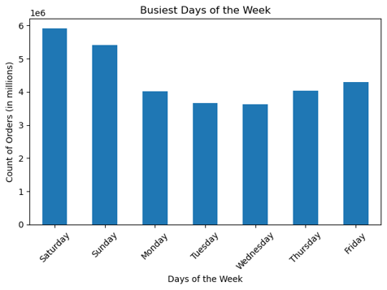
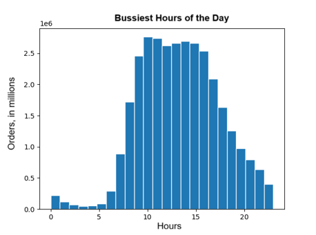
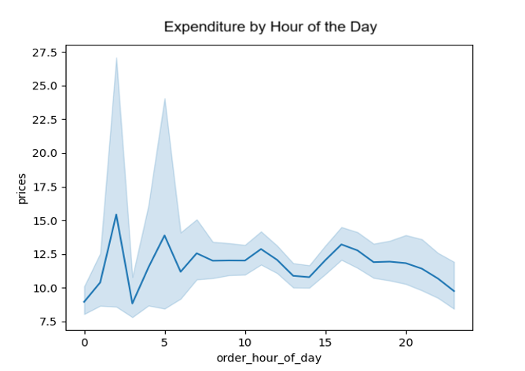
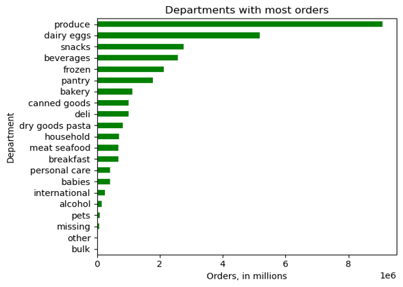
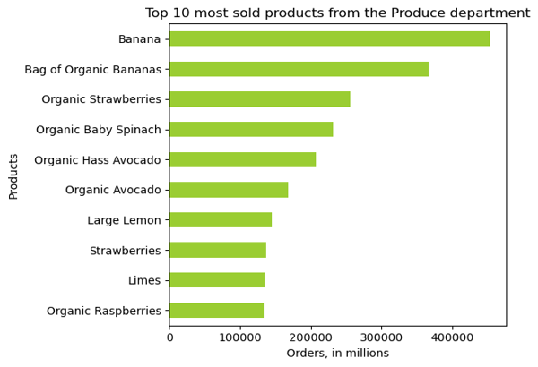
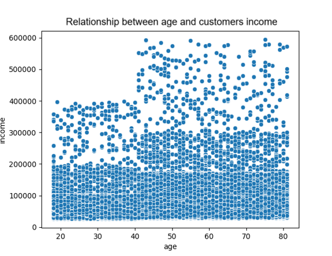
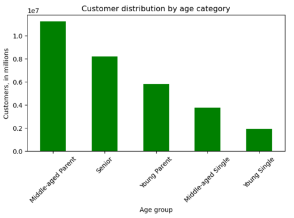
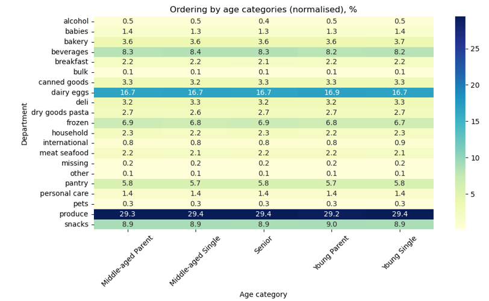

# Instacart Ordering Patterns and Segmentation Insights

## Project Goal
Explore Instacart’s transactional and demographic data to identify behavioral trends that can guide more effective marketing strategies and product positioning.

## Objectives
- Identify peak shopping times and spending patterns to optimize ad scheduling and product promotions.
- Analyze product popularity and departmental order frequency to guide pricing and inventory strategies.
- Segment customers based on loyalty, region, and demographics to support targeted marketing campaigns.
- Explore behavioral differences across customer profiles to improve personalization and engagement.

## Data:
- “The Instacart Online Grocery Shopping Dataset 2017” that includes orders, products, departments, and timing data accessed from www.instacart.com/datasets/grocery-shopping-2017 via Kaggle.
- Customer Data Set: Contains demographic and loyalty information for segmentation analysis. 
- Data Dictionary: Provides metadata and definitions for all variables used in the analysis. 

## Scope
- Analyze Instacart’s 2017 order, product, and customer datasets.
- Identify peak ordering times and high‑demand product categories.
- Build customer segments using demographic and behavioral features.
- Create derived variables and aggregated summaries to compare groups.
- Visualize key patterns and deliver actionable marketing recommendations.

## Tools:
- Python (pandas, NumPy, matplotlib, seaborn, scipy)
- Jupyter Notebook for analysis and documentation
- Anaconda for environment and package management
- Excel for reporting and final summaries
- PowerPoint to present findings and recommendations to stakeholders.

## Skills:
- Data cleaning, wrangling, and merging large datasets
- Exploratory data analysis and descriptive statistics
- Customer segmentation and feature engineering
- Data visualization and insight communication
- Workflow organization, coding etiquette, and reproducible analysis

# Methodological Approach
## Data Preparation
- Imported Instacart’s 2017 datasets and the customer file into Jupyter.
- Cleaned data by fixing mixed types, removing duplicates, and handling missing values.
- Standardized column names, validated identifiers, and merged all datasets into a unified dataframe.
- Created derived variables and flags.

## Analysis
- Performed exploratory analysis to identify ordering patterns by day, hour, and spending level.
- Analyzed product popularity across departments and price groups.
- Segmented customers by demographics and behavior to compare ordering habits.
- Used grouping, aggregation, and cross‑tab analysis to uncover trends across regions and customer types.

## Results 
- Identified peak order times, high‑spending periods, and top‑performing product categories.
- Revealed distinct customer segments with differing loyalty, basket sizes, and product preferences.
- Highlighted regional and demographic differences in purchasing behavior.
- Delivered insights to support targeted marketing and improved customer segmentation.

---

## What the busiest days of the week and hours of the day are?

Order volume peaks on Saturday and Sunday, making them the busiest days of the week.

Customer ordering activity is heavily concentrated between 8 a.m. and 3 p.m., with minimal engagement overnight and a sharp decline after early evening.

## Whether there are particular times of the day when people spend the most money?

- High-value purchases occur during low-volume hours, especially around 2–4 a.m., when fewer orders are placed but average expenditure peaks.
- Post-5 a.m. sees a rise in order volume, accompanied by a drop in average spending, reflecting a shift toward more frequent, lower-cost purchases.
- Targeted promotions during off-peak hours could leverage high-value behavior and boost revenue through premium product placements.

## Which departments and products are more popular?

The Produce department leads in overall order volume, followed by Dairy & Eggs, Snacks, Beverages, and Frozen, indicating these are core staples for customers. 

Within Produce, bananas are the top-selling item, with nearly half a million orders.

## What different classifications does the demographic information suggest? Age? Income? Types of goods? Family status?

Customer age and income do not have direct relationship suggesting that age alone does not directly impact income status.

The majority of customers are Middle-aged (over 33 years old).

## What differences in ordering habits of different customer profiles? 

- Purchasing behaviour across store departments remains largely consistent regardless of age category.
- Produce, snacks, and dairy/eggs dominate order volume across all segments.
- Age alone does not significantly influence department-level shopping patterns.
- Lifestyle or household composition may better explain product-level engagement.

## Key Findings:

- The most vulnerable population for the flu in the USA –  people 65-85 years old.
- States with a high senior population have high influenza-related mortality – California, New York, Texas, Florida, Pennsylvania.
- Flu season is seasonal and typically begins in late autumn. It usually peaks during the winter months, most commonly between December and February.

## Recommendations:

- Weekend traffic (Saturday–Sunday) drives the highest order volume, with peak activity between 8 a.m. and 3 p.m.
- High‑value purchases occur during low‑volume hours (2–4 a.m.), suggesting premium‑oriented behavior overnight.
- Produce is the most frequently ordered department, with bananas leading all individual products.
- Customer age and income show no strong correlation, and age alone does not meaningfully influence department‑level purchasing patterns.
- Ordering behavior is consistent across age groups, indicating lifestyle or household composition may be stronger predictors than age.

---

## Project Challenges 

- Large datasets required extensive cleaning, merging, and validation before analysis.
- Customer demographics offered limited explanatory power, making segmentation less straightforward.
- High variability in order volume across hours and days complicated comparisons of spending behavior.
- Department‑level patterns were highly uniform across age groups, reducing the usefulness of age‑based segmentation.
- Identifying meaningful customer profiles required synthesizing multiple behavioral and demographic variables.

## Solutions:

- Performed systematic data cleaning, type correction, and merging to create a unified, analysis‑ready dataset.
- Introduced derived variables (e.g., loyalty flags, price ranges, age categories) to strengthen segmentation.
- Used hourly and daily aggregations to isolate spending vs. volume patterns and reveal off‑peak high‑value behavior.
- Shifted focus from age‑only segmentation to multi‑factor profiling incorporating lifestyle indicators and basket composition.
- Visualized patterns across departments, time periods, and customer groups to support targeted marketing recommendations.

             

---

## Future Steps:

- Deepen customer segmentation by incorporating lifestyle indicators, household size, and basket composition patterns.
- Build predictive models to forecast order volume by hour/day and anticipate high‑value purchasing windows.
- Explore product affinity analysis to identify frequently co‑purchased items and improve cross‑selling strategies.
- Conduct regional‑level deep dives to tailor marketing campaigns and optimize inventory distribution.
- Test targeted promotions during off‑peak high‑value hours to validate revenue‑boosting opportunities.

---

## Project Files

For more details, see the [Project on GitHub](https://github.com/Daria-Navrotska/Instacart_Grocery_Basket_Analysis)
