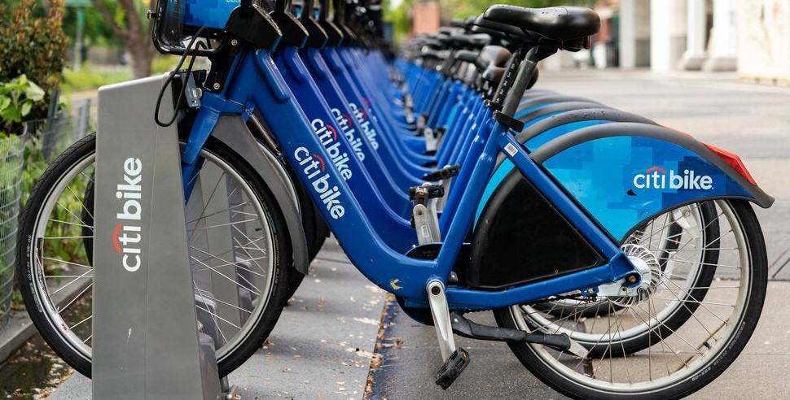
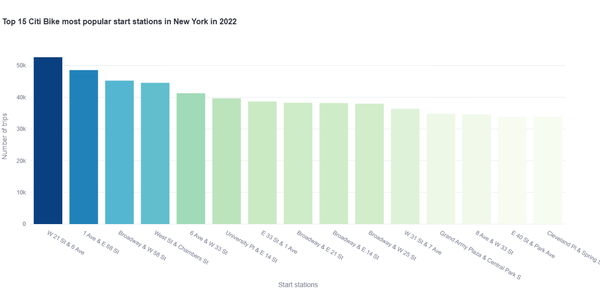
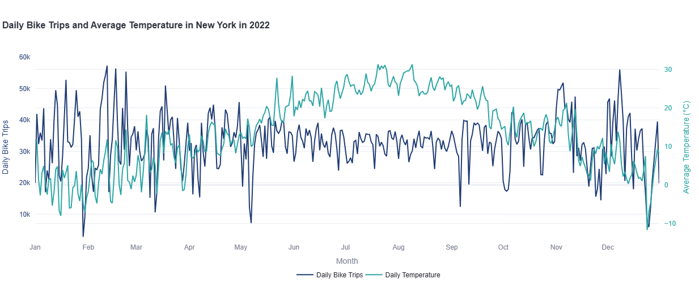
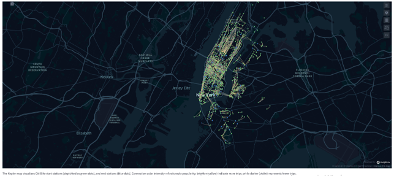
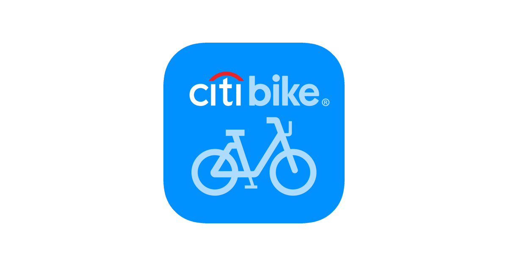

# Mapping the Pulse of NYC: A 2022 Citi Bike Demand

Since its launch in 2013, Citi Bike has grown into New York City’s largest bike-sharing program and one of the biggest worldwide. Rising demand - especially since the COVID-19 pandemic - has exposed weaknesses in station capacity and bike distribution. Stations in busy commuter areas often run out of bikes, while others remain full, preventing returns. This project investigates the causes of such imbalances and provides data-backed recommendations to improve operational efficiency and customer satisfaction.

  

## Project Goal
Analyze user behavior of a bike-sharing service based in New York City (USA) to help the business strategy department
assess the current logistics model of bike distribution across the city and identify expansion opportunities.

## Objectives
The main objective is to perform a descriptive analysis of Citi Bike’s 2022 data and generate actionable insights about:

- Where and when bike shortages or surpluses occur?
- Which stations experience the highest demand?
- How seasonality and weather affect bike usage?
- Whether current station placement ensures fair coverage across the city?

## Data:
- [Citi Bike Dataset](https://s3.amazonaws.com/tripdata/index.html): Open-source transaction data capturing New York bike-sharing trips throughout the year 2022 (including start/end times, station locations, and trip types).  
- Weather Data from [NOAA](https://www.noaa.gov/) LaGuardia Airport Station: Enrichment dataset sourced via NOAA’s API service to account for daily environmental factors affecting ridership.
- [Waterfront Access Plans](https://data.cityofnewyork.us/Environment/Waterfront-Access-Plans/d9z4-v86m).

## Scope
- Build hands-on experience with Python, API integration, and interactive geospatial mapping in a real-world urban logistics context.
- Learn to translate raw, large-scale trip logs and weather data into strategic insights for business decision-makers.
- Gain exposure to cross-functional data delivery, serving as the bridge between technical analytics and business development teams.
- Craft a compelling strategic dashboard project that highlights data engineering, visualization, and deployment skills. 

## Tools:
- Python (v3.13): pandas, requests, matplotlib, seaborn, plotly, kepler.gl, streamlit.
- Jupyter Notebook / Anaconda.
- API from the National Centers for Environmental Information (NOAA).

## Skills:
- API data sourcing and programmatic data integration.
- Structured data cleaning, aggregation, and merging of disparate datasets within Python.
- Spatial data manipulation and interactive mapping.
- Dashboard interface design, UI/UX optimization, and multi-page deployment.  
- Presenting insights and recommendations to stakeholders.
- Storytelling and reporting.

  

# Methodological Approach
## Project Planning
Formulated analytical questions to guide dashboard development:
- Which stations attract the highest ridership in the city?
- During which months is trip activity at its peak? Does the weather influence travel patterns?
- What are the most common station-to-station routes?
- How evenly are stations spread across the network?
- Designed a visualization plan pairing each question with an appropriate chart or map.

## Data Sourcing and Preparation
- Downloaded Citi Bike 2022 trip data and sourced daily weather data from NOAA’s API.
- Used list comprehension and generators to efficiently read and combine multiple monthly CSV files.
- Cleaned datasets, standardized date formats, and merged the trip and weather data for combined analysis.

## Descriptive and Exploratory Analysis
- Calculated trip frequencies by station and month to identify demand peaks.
- Analyzed seasonal trends and correlations with temperature and precipitation.
- Mapped the geographic distribution of stations to identify underserved areas.

## Visualization and Dashboard Deployment
- Created visualizations using Matplotlib, Seaborn, and Plotly.
- Designed interactive geospatial maps in Kepler.gl.
- Built a prototype dashboard in Streamlit, organizing visual outputs into clear sections: Popular Stations, Seasonal Patterns, Weather Impact, Station Distribution.

## Results
- Clear identification of high-demand stations and routes.
- Evidence of seasonal and weather-driven variations in trip volume.
- A visual representation of station density and gaps across New York City.
- Actionable recommendations to support management’s strategic decisions.

---

## New York Citi Bike Strategy Dashboard

Dashboard explores CitiBike’s company usage patterns in 2022 to reveal when and where imbalances occur, helping identify opportunities to improve distribution efficiency andenhance the overall rider experience.
Who is Citi Bike?

**Who is Citi Bike?**

Citi Bike is New York City’s flagship bike‑sharing program, offering residents and visitors a fast, sustainable alternative to traditional transportation. **Since its launch in 2013**, the system has expanded into one of the largest in the world, serving Manhattan, Brooklyn, Queens, and parts of the Bronx with thousands of bikes and docking stations. **As ridership continues to grow, so do the operational challenges—stations frequently run empty in high‑demand areas while others remain full, limiting users’ ability to pick up or return bikes**. 

  

The dashboard explores CitiBike’s 2022 usage patterns to reveal when and where these imbalances occur, helping identify opportunities to improve distribution efficiency and enhance the overall rider experience.

**Most popular Citi Bike start stations in 2022**

The bar chart highlights the start stations with the highest bike‑trip volumes, showing a strong concentration of activity at a small number of central locations.
**Most popular starting points in NY in 2022 — W 21 St & 6 Ave, 1 Ave & E 68 St,Broadway & W 58 St, and West St & Chambers St** — stand out clearly (marked by blue color), with significantly taller bars than the rest.
This contrast underscores how heavily riders rely on a few key departure stations, particularly in central Manhattan, where these stations consistently generate the highest volumes of Citi Bike trips.
To further explore these patterns, please use the interactive map available through the sidebar selection box.

**Weather component and bike usage**

This dual-axis line chart demonstrates a strong, temperature‑driven pattern in bike usage: **as temperatures rise, daily ridership increases**, and **as temperatures fall, usage drops sharply**.
This indicates that **Citi Bike shortages are primarily a warm‑season issue**, concentrated between **May and October**.
Across many cities — and reflected in this dataset — summer ridership reaches peak levels (around 100%), while winter usage typically falls to **30–50%** of that peak, depending on weather conditions and holiday periods.

**Interactive map with aggregated bike trips**

The Kepler map visualizes Citi Bike start stations (depickted as green dots), and end stations (blue dots). Connection color intensity reflects route popularity: brighter (yellow) indicate more trips, while darker (violet) represents fewer trips.

Map demonstrate that:
- The densest clusters appear in Midtown and Lower Manhattan, driven by commuter flows and tourism.
- Strong recreational patterns are visible around Central Park and the Hudson River Greenway.
- Route density drops sharply outside Manhattan due to lower station density and less bike infrastructure.
- Outer boroughs (Queens, Bronx, deeper Brooklyn) show far fewer connections.
- Jersey City and Roosevelt Island appear as small, isolated pockets of activity.
- Overall, the map shows that Citi Bike demand is highly concentrated in Manhattan’s core, with short, repetitive, high‑volume trips
- These patterns suggest that Citi Bike rebalancing and fleet distribution should prioritize central Manhattan and the highlighted corridors.

## Key Findings:

- Temporal Constraints: Severe shifts in ridership occur across different seasons, pointing to a need for fluid seasonal strategy rather than a static model.
- Logistical Bottlenecks: Specific high-traffic routes create daily "docks full" or "empty station" crises, showing that distribution issues stem from asymmetric commuting patterns.
- Weather Sensitivity: Clear correlations between specific weather thresholds and dramatic usage spikes/drops, which serves as a predictive indicator for bike demand. 

## Recommendations:

The analysis indicates that Citi Bike should prioritize the following strategic objectives moving forward:
- 🚲 Increase docking capacity at top stations to reduce congestion and ensure bikes are consistently available.
- 🔄 Implement dynamic bike rebalancing, especially during morning and evening peak hours when demand shifts rapidly.
- ❄️ Adjust docking stations space seasonally — stations don’t need to be fully stocked during winter months.
- 🌞 Plan for seasonal surges: waterfront and leisure‑area demand spikes in warm months, so use modular stations that can scale up for summer.
- 📈 Stock bikes more heavily in warmer months to meet higher demand, and reduce supply in winter and late autumn to lower logistics costs.
- 🚨 Use automated alerts to dispatch rebalancing crews when station levels cross critical thresholds.

---

## Project Challenges 

- Managing and cleaning massive, multi-gigabyte open-source trip logs alongside API-driven unstructured weather data.
- Presenting intricate spatial-temporal insights without overwhelming non-technical stakeholders. 

## Solutions:

- Leveraged optimized Pandas aggregations and programmatic sorting to merge weather profiles with trip metrics cleanly.
- Utilized Streamlit's multi-page design principles to separate different variables across individual tabs, creating a scannable narrative.  

---

## Future Steps:

Integrating real-time inventory tracking and expanding the dataset across consecutive years to form predictive machine learning models for live fleet rebalancing.

  

---

## Project Files

For more details, see the [new-york-citi-bike-2022](https://github.com/Daria-Navrotska/new-york-citi-bike-2022) project on GitHub, [New York CitiBike 2022](https://new-york-citi-bike-2022-dashboard.streamlit.app/) interactive Python-geerated dashboard on Streamlit, and presentation obtained results on video ["Exploring New York Citi Bike Strategy Dashboard"](https://share.vidyard.com/watch/1e3J4ggaPqn8eUq59r6PGE).
