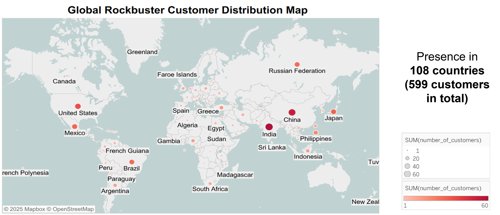
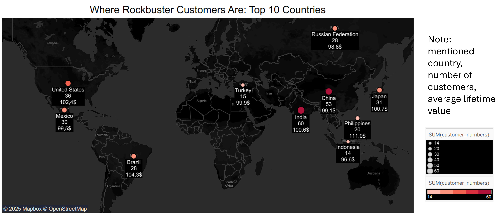
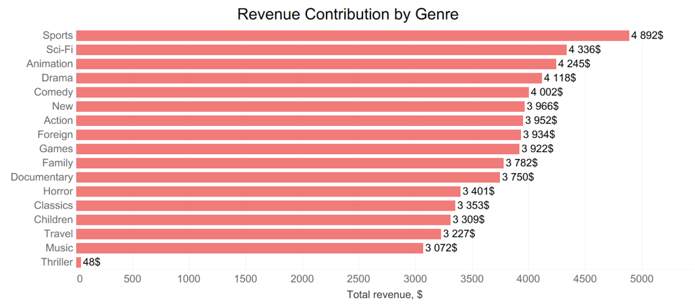
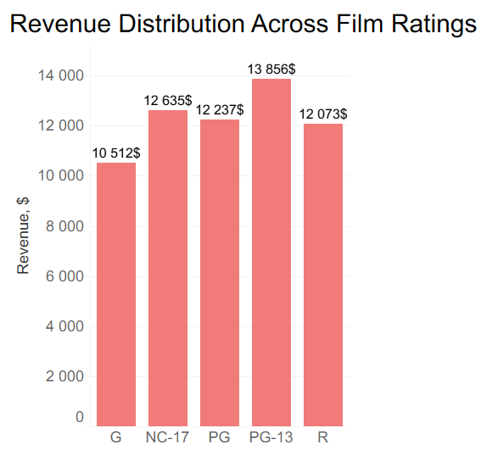
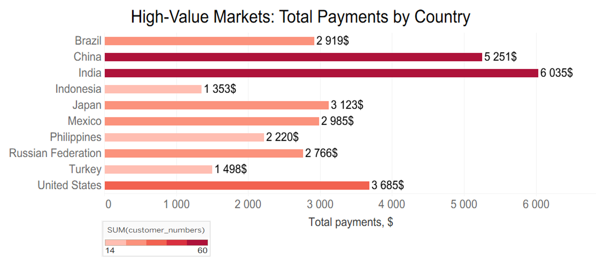

# Rockbuster Steals: Data Insight for Strategic Growth

  

## Project Goal
Rockbuster Stealth LLC is a movie rental company that used to have stores around the world. Facing stiff competition against modern streaming competitors, Rockbuster Stealth is planning to use its existing movie licenses to launch an online video rental service in order to stay competitive.
The goal is to optimize the digital launch of Rockbuster Stealth's online video rental service by auditing customer lifetime value, assessing regional sales variations, and evaluating movie license revenue to guide stakeholder strategy.
And answear such questions:
- Which  movies  contributed  the  most/least  to  revenue  gain?     
- What  was  the  average  rental  duration  for  all  videos?   
- Which  countries  are  Rockbuster  customers  based  in?   
- Where  are  customers  with  a  high  lifetime  value  based?   
- Do  sales  figures  vary  between  geographic  regions? 

## Objectives
- Identify which movies generate the highest and lowest revenue to guide licensing and promotion strategies.
- Analyze customer demographics and geographic distribution to target high-value regions for the online launch.
- Evaluate rental duration patterns to optimize pricing and content availability.
- Compare sales performance across countries to inform regional marketing and inventory decisions.
- Develop a comprehensive data dictionary and entity relationship diagrams to clarify data points for both technical and non-technical stakeholders.
- Provide data visualizations and a presentation deck to guide the Rockbuster Stealth Management Board’s executive decision-making process. 

## Data:
Rockbuster data set that includes several linked data files (~3MB) can be download here - [dvdrental.zip](https://www.postgresqltutorial.com/wp-content/uploads/2019/05/dvdrental.zip)
- Rockbuster Film Inventory: Includes movie titles, categories, and rental durations. 
- Customer Information: Contains geographic and lifetime value data. 
- Payment Records: Tracks revenue contributions by movie and region. 
Data is stored in a relational format and loaded into a PostgreSQL database for analysis.

## Scope
- Build hands-on experience with SQL and relational databases in a real-world business context.
- Learn to translate raw data into strategic insights for decision-makers.
- Gain exposure to cross-functional collaboration with BI, marketing, and operations teams.
- Craft a compelling data analysis project that highlights your SQL and visualization skills.

## Tools:
- PostgreSQL: For writing SQL queries and managing relational data.
- Excel: To organize results and build a data dictionary.
- Tableau: For creating visualizations of customer distribution and revenue trends.
- PowerPoint: To present findings to Rockbuster’s management team.

## Skills:
- Data cleaning, aggregation, and relational integration via SQL JOIN statements.
- Advanced querying (Subqueries, Common Table Expressions/CTEs) to extract business logic.
- Descriptive statistics calculation and data profiling.
- Geographical mapping and interactive visualization building.
- Translation of complex database queries into stakeholder presentations.

    

# Methodological Approach
## Data Preparation
- Defined schema relationships, resolved primary/foreign key connections, and systematically handled dirty or inconsistent entries.
- Constructed a robust data dictionary detailing data types, table structures, and constraints.

## Analysis
- Calculated descriptive statistics for movie performance and rental trends via grouping, ordering, and filtering (WHERE, HAVING, and CASE statements).
- Applied multi-table joins and CTEs to aggregate geographic data across addresses, cities, and countries to compute Regional Lifetime Values.

## Results 
- Summarized complex SQL queries into a clean interim spreadsheet report for technical peers.
- Developed a dynamic Tableau storyboard highlighting top-performing customer clusters, regional trends, and film inventory breakdowns.
- Delivered a clear executive narrative and final presentation tailored specifically for board-level decision-makers.

---

## In which  countries  are  Rockbuster  customers  based? 

This map shows the global distribution of Rockbuster customers, using circle sizes to represent customer density. Key concentrations appear in the U.S., Brazil, Europe, India, and Southeast Asia.

## Where  are  customers  with  a  high  lifetime  value  based?

The map highlights Rockbuster’s top 10 customer countries, showing both the number of customers and their average lifetime value. Larger circles and darker red color indicate more customers, while annotated values reveal where individual customers are most valuable.

## Which movies contributed the most/least to revenue gain? 

The horizontal bar chart titled "Revenue Contribution by Genre" displays total revenue generated by each film genre. Each bar represents a genre, with its length corresponding to the total revenue in dollars. Genres like Sports ($4,892), Sci-Fi ($4,365), and Animation ($4,336) lead the chart, while Thriller ($1,485) sits at the bottom. The most contributing genres ( Sports, Sci-Fi, Animation) and least contributing genres (Thriller, Music, Travel).

## Which Ratings Drive the Most Sales?

This vertical bar chart shows how film ratings impact revenue. PG-13 films generate the highest revenue ($13,856), followed by NC-17 and PG, while G-rated films earn the least among the group. It highlights which ratings are most financially successful.

  

## How the sales figures vary between different geographic regions?

That horizontal bar chart shows total payments by Rockbuster customers across the top 10 countries, highlighting where the platform’s most financially engaged users are located. India and China lead in total payments, making them key high-value markets, while other markets like the U.S., Japan, and Brazil also show strong payment volumes.

## Key Findings:

- Among geographic regions, India contributes the most in total payments, followed by China and the United States.
- Genres like Sports, Sci-Fi, and Animation generate the highest revenue. These genres are key drivers of profitability.
- Films rated PG-13 generate the highest revenue across all rating categories suggesting that it strikes the best balance between broad audience appeal and profitability.
- Genres like Sports, Animation, and Action show high rental counts, indicating a strong correlation between content availability and customer engagement.
- Genres as Thriller, Music, and Travel rank lower in both revenue and rental activity, signaling lower customer demand and potential areas for content reevaluation or targeted marketing.

## Recommendations:

- Target High-Value Markets (India, China, and the U.S.A ).
- Prioritize High-Performing Genres (Sports, Animation, Action).
- Leverage PG-13 Content as it generate most revenue.
- Reevaluate Low-Performing Segments (Thriller, Music, and Travel).
- Align Inventory with Demand - number of titles per genre reflects rental behavior.

 

---

## Project Challenges 

- High-volume relational tables required extensive cleaning, profile-building, and integrity validation before executing analytical queries.
- Customer distribution across different cities and global regions was disparate, complicating the identification of localized, high-lifetime-value market clusters.
- Movie license performance data was siloed across separate inventory, film, and payment tables, making comprehensive revenue tracking difficult to evaluate at a glance.
- Translating deeply nested relational query logic into an operational structure frequently resulted in overly complex, hard-to-maintain SQL scripts.
- Aggregated data grids and raw query results lacked the clarity needed to tell a compelling story directly to non-technical executive board members.

## Solutions:

- Conducted systematic data profiling, uniformity checks, and primary/foreign key validations to establish a clean relational database schema in PostgreSQL.
- Utilized multi-table geographical relational joins across customer address records to isolate top-performing revenue countries and high-value city hubs.
- Integrated inventory metrics, rental frequencies, and payment records via SQL queries to accurately pinpoint the highest and lowest revenue-generating movie licenses.
- Converted heavy, multi-layered subqueries into modular Common Table Expressions (CTEs) to improve query performance, readability, and logic isolation.
- Visualized structural query outputs into interactive Tableau storyboards and executive presentation decks to clearly communicate trends and strategic recommendations.

---

## Future Steps:

- Integrate Streaming Metrics: Expand the schema to track digital engagement metrics like watch time and drop-off rates against legacy rental habits.
- Predict Subscriber Churn: Use historical customer lifetime value (LTV) and payment data to build predictive models for user retention.
- Automate Live Dashboards: Connect Tableau directly to the cloud database to replace static reporting with automated, real-time regional revenue tracking.
- Localize Content Recommendations: Run A/B tests on regional genre preferences to optimize content catalogs for high-value international hubs.
- Optimize License Spending: Establish a data pipeline to continuously audit and phase out low-performing movie licenses based on changing viewer demand.

---

## Project Files

For more details, see the [Rockbuster_Stealth_Data_Analysis_Project-](https://github.com/Daria-Navrotska/Rockbuster_Stealth_Data_Analysis_Project-) on GitHub.
