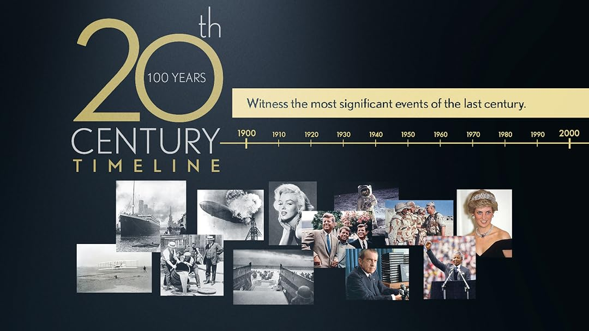

## Portfolio

---

### Preparing for influenza season in the USA

  

  

    <a href="/influenza"><strong>Planning for Influenza Season in the U.S.A.</strong></a>
    

Based on data from 2009 to 2017, an average of 46158 people died from influenza each year. The project analyzes US CDC (Centers for Disease Control and Prevention) and Census Bureau data from 2009–2017 to identify flu trends and highlighting states with large vulnerable populations to ensure timely support for those at highest risk. The findings were visualized in a Tableau storyboard. 
    

  

---

### Instacart Grocery Basket Analysis

  

  

    <a href="/Instacart"><strong>Instacart Ordering Patterns and Segmentation Insights</strong></a>
    

This project analyzes Instacart’s 2017 grocery ordering data to uncover customer purchasing patterns and support targeted marketing strategies. By cleaning, merging, and exploring multiple datasets, I identified peak ordering times, high‑value customer segments, and product categories with the strongest demand. The insights informed recommendations for personalized promotions and more efficient ad scheduling. 
    

  

---

### Heart Attack Risk Prediction Analysis

  

  

    <a href="/Heart_Attack_Risk"><strong>Uncovering Hidden Patterns in Heart Attack Risk</strong></a>
    

Using a rich dataset of patient health and lifestyle attributes, this project explores the hidden drivers behind heart attack risk across diverse populations. Through systematic data cleaning, linear correlation analysis, categorical comparisons, country‑level mapping, linear regression between age and heart rate, and both 2D and 3D clustering, I uncovered the strongest predictors and surprising interactions among clinical and behavioral factors. The findings offer a compelling look at how everyday habits and physiological markers combine to influence cardiovascular vulnerability.
    

  

---

### GameCo – Global Video Game Sales

  

  

    <a href="/GameCo"><strong>Global Video Game Sales Analysis for Market Strategy</strong></a>
    

Using historical sales data from 1980–2016, this project analyzes global video game performance across genres, platforms, and publishers to support GameCo’s market‑entry strategy. Through descriptive statistics, pivot‑table exploration, and multi‑region comparisons, I identified the genres driving the highest demand and the publishers dominating key markets. The insights highlight long‑term popularity trends and regional sales shifts that can guide marketing, budgeting, and competitive positioning. 
    

  

---

### Rockbuster Stealth LLC Data Analysis

  

  

    <a href="/Rockbuster"><strong>Rockbuster Data Insights: SQL for Strategic Growth</strong></a>
    

This project explores Rockbuster’s multi‑table SQL database, containing years of historical rental and payment data across thousands of customers worldwide. By querying revenue contributions, mapping customer distribution, and comparing regional sales performance, I uncovered where the company’s strongest markets truly lie. These insights informed a data‑driven strategy for Rockbuster’s transition from physical rentals to online streaming. 
    

  

---

### Key Events of the 20-th Century

  

  

    <a href="/20th_century"><strong>Historical Network Mapping of 20th‑Century Global Relations</strong></a>
    

This project uses web‑scraped text from the Wikipedia page “Key events of the 20th century” to build a structured network of country‑to‑country relationships. Through text mining, NLP entity extraction, and centrality calculations, I quantified each nation’s prominence and connectivity within major historical events. The resulting network graph visualizes relationship clusters and influence pathways, providing a clear analytical overview for policy researchers. 
    

  

---

### New York CityBike Trips Analysis 

  

  

    <a href="/NY_CityBikes"><strong>Mapping the Pulse of NYC: A 2022 CityBike Demand</strong></a>
    

Using Citi Bike’s 2022 trip data enriched with NOAA weather records, this project analyzes rider behavior to diagnose distribution bottlenecks across New York City. Through descriptive statistics, route aggregation, seasonal trend analysis, and geospatial mapping with Kepler.gl, I identified the stations and time periods driving the highest imbalance. The insights were consolidated into an interactive Streamlit dashboard designed to guide business strategy teams in optimizing bike availability and planning future expansion.
    

  

