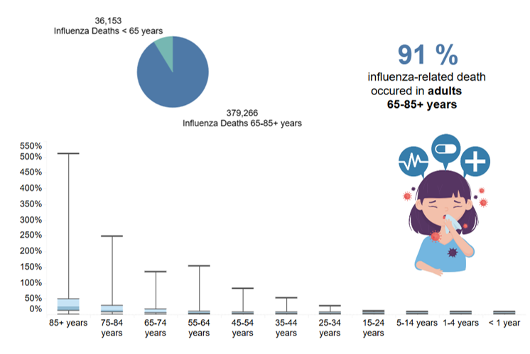
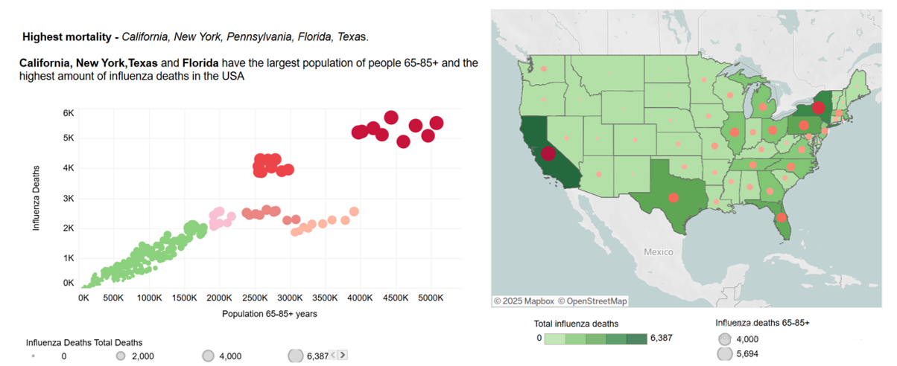
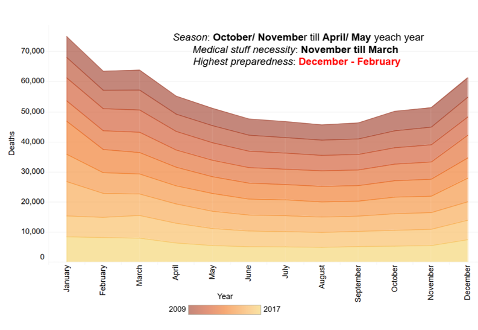

# Planning for Influenza Season in the U.S.A.

## Project Goal
Enable a U.S.A. medical staffing agency to anticipate influenza‑related surges and allocate temporary healthcare workers across all country. The analysis focuses on identifying flu trends and highlighting states with large vulnerable populations to ensure timely support for those at highest risk.

## Objectives
- Identify vulnerable population groups and high‑risk states.
- Analyze U.S. flu mortality trends from 2009-2017.
- Identify peak periods requiring additional medical  staffing.
- Create a data‑informed strategy for allocating medical personnel.
- Present actionable insights to support strategic resource planning.

## Data:
- CDC Influenza Deaths dataset
- Population data (US Census)
- Survey of influenza test results (CDC)
- Survey of flu shot rates in children (CDC)

## Scope
- Analyze historical flu mortality data (2009-2017)
- Identify high-risk states and vulnerable populations
- Determine optimal timing for staff deployment
- Develop data-driven staffing allocation strategy
- Provide actionable recommendations for resource planning

## Tools:
- Excel
- Tableau
- Hypothesis testing
- Storytelling

## Skills:
- Data cleaning, aggregation, and integration.
- Spatial and temporal visualizations.
- Hypothesis testing and correlation analysis.
- Presenting insights and recommendations to stakeholders.
- Reporting.

## Methodological Approach
# Data Preparation
- Defined key data questions and research plan.
- Formulated a research hypothesis to guide the analysis.
- Identified available datasets: their relevance, limitations, and integrity.
- Created detailed data profiles covering data types, accuracy, consistency, completeness, uniqueness.
- Cleaned and standardized the datasets, addressing missing values and quality.
- Transformed and integrated data from multiple sources into a single dataset.

# Analysis
- Calculated descriptive statistics, including variance and standard deviation for key variables.
- Explored relationships through correlation analysis.
- Conducted hypothesis testing and interpreted significance
- Built exploratory visualizations and connected the dataset to Tableau.

# Results 
- Summarized analytical findings in an interim report.
- Developed a Tableau storyboard highlighting trends, forecasts, and patterns.
- Delivered a clear narrative and presentation of insights for stakeholders.

---

## Who is at higher risk?

To investigate age-based vulnerability, I made pie chart and histogram demonstrating that **individuals 65 years and older** account for the majority of influenza-related deaths between 2009 and 2017. This highlights the need to give **priority to elderly populations in the medical staffing plans**.

## States with a high number of influenza-related deaths and medical demand

To examine geographic trends, I used bubble chart and combo map to reveal a correlation between states with high senior populations and elevated flu-related mortality. **California, New York, Texas, Florida and Pennsylvania have the largest population of the people 65-85+ years and the highest amount of influenza mortality in the USA.** These states should be in high priority for medical support.

## How long does the flu season last in the USA?

The timing of flu in the USA is very important as it has a definite seasonal character. Using an area chart, I want to highlight that the **flu season in the USA typically lasts from October/November until April/May** every year. This means that **staffing efforts should increase in late autumn** to meet demand and **be fully established during the peak months of December to February.**

### Key Findings:

- The most vulnerable population for the flu in the USA –  people 65-85 years old.
- States with a high senior population have high influenza-related mortality – California, New York, Texas, Florida, Pennsylvania.
- Flu season is seasonal and typically begins in late autumn. It usually peaks during the winter months, most commonly between December and February.

### Recommendations:

- Send healthcare staff to elevated death-rate states.
- Deploy specialists to vulnerable populations.
- Assign helpers early to high-risk areas.
- Boost vaccination efforts.
- Track flu spread and mortality rate regularly.
  
---

## Project Challenges 

- Age group granularity: age brackets used (e.g., 65–85+ years) are broad, more detailed segmentation could uncover nuanced risk levels.
- Missing or estimated data: Census and CDC data often include estimates, which may introduce uncertainty or bias.
- Temporal gaps: dataset ends in 2017, that is why it doesn’t reflect recent flu seasons or the impact of COVID on influenza trends.
- Geographic bias: states with better reporting systems and monitoring may appear to have higher influenza-related deaths simply due to more complete data.

## Solutions:

- Ran one-tailed t-test to statistically confirm elderly risk hypothesis (65+ age group).
- Combined CDC mortality data with U.S. Census demographics to fill missed values.
- Created spatial and temporal visualizations in Tableau dashboard to clearly communicate findings to stakeholders.

---

### Future Steps:

- Expand the analysis using the most recent data available.
- Combine clinical and demographic sources for the epidemiological survey to gather data on symptoms, vaccination status and patient access to healthcare.
- Use predictive models to forecast future medical personnel needs.

---

## Project Files

For more details, see the [Tableau Project Storyboard](https://public.tableau.com/app/profile/daria.navrotska/viz/PreparingforInfluenzaSeasoninUSAStorytellingwithDataPresentations/InfluenzaStory)
